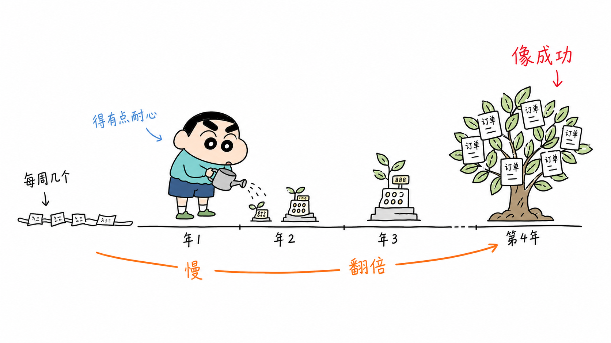
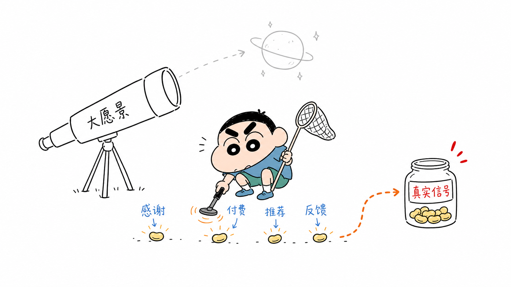
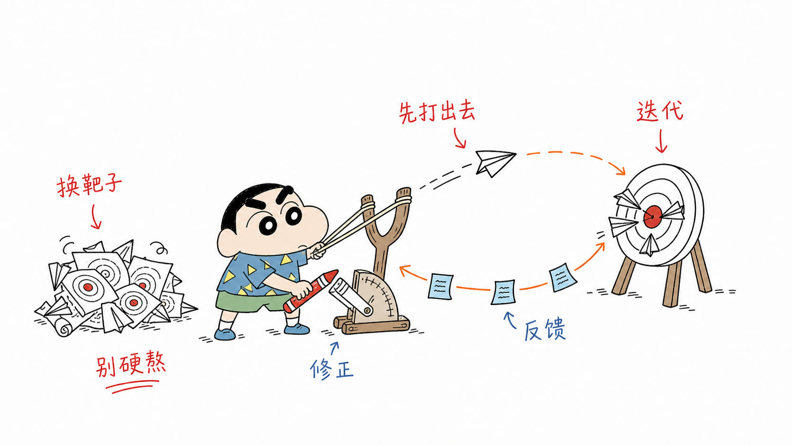
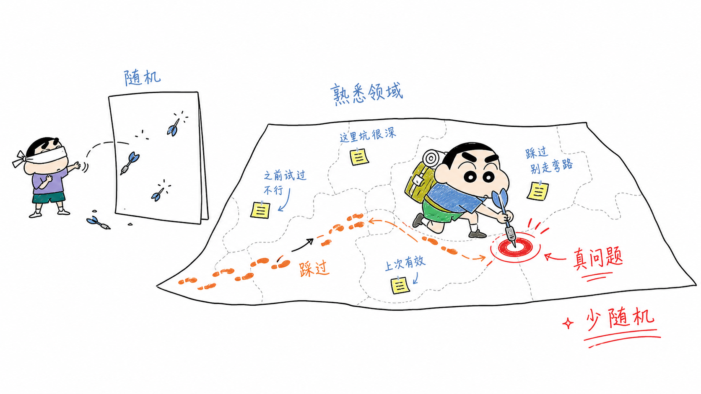
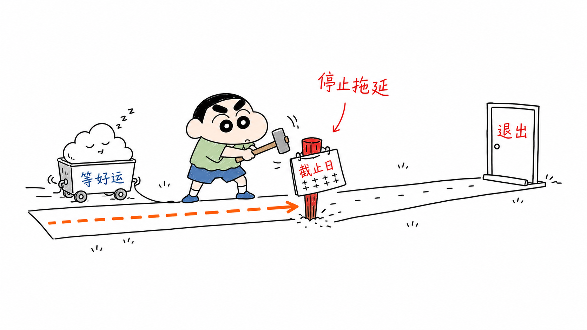

# Xin Xiaoxin Illustrations

> 把中文长文里的判断、流程、卡点和隐喻，变成一张张白底、手绘、有点好笑但能看懂的正文配图。
>
> 16:9 横版 | 原创淘气小孩 IP | 中文手写批注 | 大量留白 | Codex Skill

---

## 这是什么

这是一个给 Codex 用的正文配图 Skill。

它不是一条万能插画 prompt，也不是 PPT 信息图模板。它更像一个“会先读文章、再帮你找画面”的小助手：

先从文章里抓出真正值得画出来的东西，比如一个判断、一个流程、一个卡点、一个前后对比，或者一个不太好讲清楚的隐喻。

然后再把它变成一张 16:9 的白底手绘正文配图。

默认角色是一个“受小新式顽皮气质启发的原创淘气小孩”。重点不是复刻某个动漫角色，而是借用那种调皮、无辜、认真捣乱的状态，让角色真的参与画面里的核心动作。

比如：掉坑、搬材料、按按钮、修机器、接住用户、把混乱想法塞进奇怪装置。

一句话：**让 AI 不只是配图，而是把文章里的一个认知动作画出来。**

> 说明：本项目使用的是原创淘气小孩 IP，只借鉴顽皮童真、夸张比例和荒诞反差感，不生成官方蜡笔小新同人或复刻角色。

---

## 适合谁

如果你经常写这些内容，会比较适合：

- 中文长文
- 知识卡片
- Notion 文档
- 方法论文章
- AI 工作流拆解
- 产品思考
- 课程和社群内容
- 个人品牌内容

尤其适合那种“文字能讲清楚，但配图很难找”的抽象概念。

不太适合：

- 商业 KV
- 精致品牌插画
- 复杂系统架构图
- 正式 PPT 流程图
- 表情包
- 大段文字型信息图
- 需要可编辑矢量源文件的场景

---

## 它会产出什么

默认可以产出：

- 一篇文章的配图 shot list
- 每张图的主题、核心意思、结构类型、角色动作和中文标注建议
- 16:9 横版 PNG 正文配图
- 白底、黑色手绘线稿、少量红橙蓝中文批注
- 适合放在文章、朋友圈长图、知识卡片、Notion 文档里的插图

默认不会产出：

- PPTX / PDF / Keynote
- SVG / HTML / Canvas 可编辑图
- 商业海报
- 复杂架构图
- 纯装饰插画

---

## 示例效果

### 成功通常比想象慢



### 早期信号比宏大愿景重要



### 坚持是基于反馈快速迭代



### 领域经验很重要



### 生活方式型生意也是真成功


### 学会退出也重要



这些图只是风格参考，不是固定模板。真正使用时，Skill 会根据当前文章重新找隐喻，不建议照抄旧图的构图。

---

## 视觉风格

这个 Skill 默认追求的是一种“白纸上的怪诞产品草图”：

- 纯白背景，不要纸纹、米色、渐变和复杂背景
- 黑色手绘线稿，轻微抖动，不要太精致
- 大量留白，画面不要塞满
- 少量红色、橙色、蓝色中文手写批注
- 一张图只讲一个核心结构
- 原创淘气小孩必须参与核心动作
- 有点好笑，但不能幼稚
- 能看懂，但不要变成 PPT 说明书

我更在意的是：角色不是站在旁边卖萌，而是真的在画面里“干活”。

---

## 安装

克隆到 Codex skills 目录：

```bash
mkdir -p "${CODEX_HOME:-$HOME/.codex}/skills"
git clone https://github.com/X38661/xin-xiaoxin-illustrations.git \
  "${CODEX_HOME:-$HOME/.codex}/skills/xin-xiaoxin-illustrations"
```

然后在 Codex 里调用：

```text
Use $xin-xiaoxin-illustrations to 给这篇文章生成 6 张正文配图。
```

---

## 怎么用

### 只做配图规划

```text
Use $xin-xiaoxin-illustrations 先不要生图。
请分析下面这篇文章哪里值得配图，输出 5 张左右的 shot list。
每张图写清楚：放在哪段后、主题、核心意思、结构类型、原创淘气小孩在做什么、建议中文标注词。

<粘贴文章>
```

### 直接生成正文配图

```text
Use $xin-xiaoxin-illustrations 把下面这篇文章生成 6 张小新式正文配图。
要求：16:9 横版、纯白背景、黑色手绘线稿、少量红橙蓝中文手写批注。

<粘贴文章>
```

### 给单个概念生成一张图

```text
Use $xin-xiaoxin-illustrations 为“早期信号比宏大愿景重要”生成一张正文配图。
画面要简单、有点好笑，但能一眼看懂。
```

### 改成你自己的角色

如果你不想用淘气小孩，也可以改：

```text
references/xiaoxin-kid-ip.md
```

可以换成小猫、小狗、机器人、品牌吉祥物、产品里的某个角色。

关键不是换皮，而是让角色参与核心动作。

---

## 工作流程

这个 Skill 大概会这样跑：

1. 读取文章、Markdown、Notion 内容、截图或用户给的主题
2. 提炼核心观点、认知转折、流程结构和适合视觉化的段落
3. 先输出 shot list，每张图只选一个认知锚点
4. 为每张图选择结构类型，比如 Workflow、前后对比、概念隐喻、地图路线、小漫画分镜
5. 重新发明一个低科技、怪诞但成立的物理隐喻
6. 让原创淘气小孩承担核心动作
7. 每张图单独生成，不把多张图拼在一起
8. 按 QA checklist 检查：白底、留白、角色动作、中文标注、非 PPT 感、非旧案例复刻
9. 保存最终 PNG，并说明每张图适合放在哪里

---

## 目录结构

```text
.
├── README.md
├── LICENSE
├── SKILL.md
├── agents/
│   └── openai.yaml
├── assets/
│   └── examples/
│       ├── 01-success-is-slow.png
│       ├── 02-early-signals.png
│       └── ...
└── references/
    ├── style-dna.md
    ├── xiaoxin-kid-ip.md
    ├── composition-patterns.md
    ├── prompt-template.md
    └── qa-checklist.md
```

---

## 使用建议

- 图片里的中文越短越稳。
- 每张图只讲一个核心结构。
- 不要把整篇文章塞进一张图。
- 角色必须参与核心动作，不能只是站在角落里。
- 示例图只用于校准风格，不要复刻构图。
- 如果中文错字严重，减少标注词再重生成。
- 如果画面太像 PPT，删掉标题、边框、网格和过多箭头。

---

## 联系与交流

如果你基于这个 Skill 做了自己的版本，或者想交流中文内容配图、Codex Skill、知识内容自动化，可以加微信：

```text
AAA38661
```
